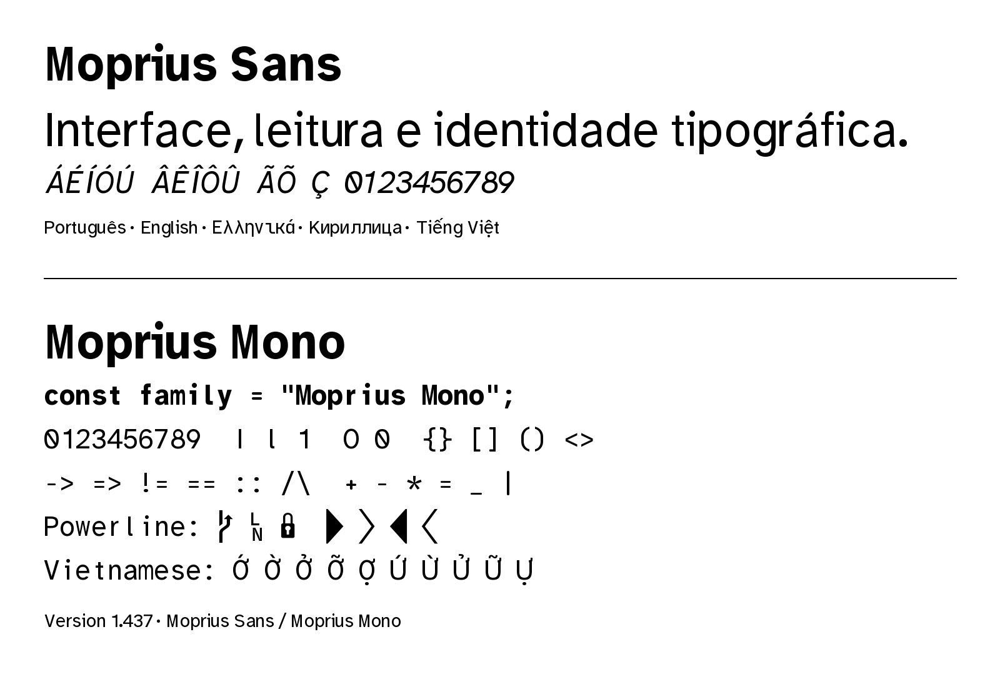
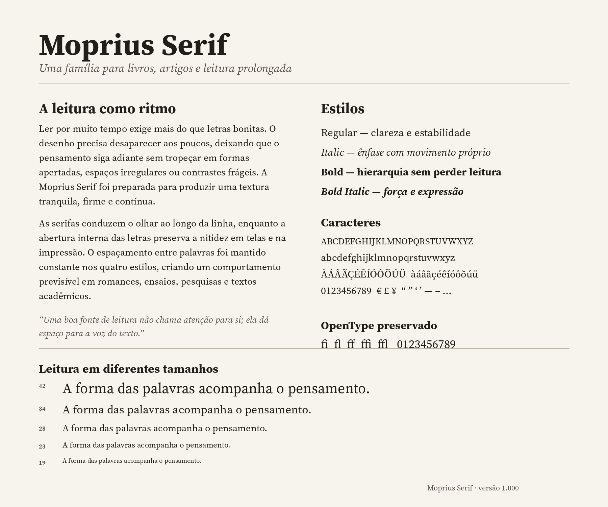

# Moprius Font Family

[Leia em português](README.pt-BR.md)

Moprius is an open-source type system with three coordinated families for interfaces, programming and long-form reading.

- **Moprius Sans 1.437** — proportional sans serif for desktop interfaces and general text.
- **Moprius Mono 1.437** — monospaced family for terminals, editors and source code.
- **Moprius Serif 1.000** — serif family for books, articles, essays and sustained reading.

The collection contains **12 static fonts**: Regular, Italic, Bold and Bold Italic in each family.





## Files

| Family | Desktop format | Web format | Styles |
|---|---|---|---|
| Moprius Sans | TTF | WOFF2 | Regular, Italic, Bold, Bold Italic |
| Moprius Mono | TTF | WOFF2 | Regular, Italic, Bold, Bold Italic |
| Moprius Serif | OTF | WOFF2 | Regular, Italic, Bold, Bold Italic |

## Install on Linux

```bash
./install-linux.sh
```

Manual installation:

```bash
mkdir -p ~/.local/share/fonts/Moprius
cp fonts/ttf/*.ttf fonts/otf/*.otf ~/.local/share/fonts/Moprius/
fc-cache -f
```

To uninstall:

```bash
./uninstall-linux.sh
```

## Web use

Import `css/moprius.css` and use:

```css
body { font-family: "Moprius Serif", serif; }
.ui { font-family: "Moprius Sans", sans-serif; }
code { font-family: "Moprius Mono", monospace; }
```

A browser specimen is available at `docs/index.html`. The `docs/` directory can be published directly with GitHub Pages.

## Repository layout

```text
fonts/ttf/       Moprius Sans and Mono desktop fonts
fonts/otf/       Moprius Serif desktop fonts
fonts/woff2/     Webfonts for all three families
sources/ttx/     Editable OpenType XML sources
tools/           Build and audit utilities
css/             Combined @font-face stylesheet
docs/            GitHub Pages specimen
specimen/        Static specimen images
audits/          Family audit reports
```

## Build and audit

```bash
python -m venv .venv
source .venv/bin/activate
pip install -r requirements.txt
python tools/build.py
python tools/audit.py
```

GitHub Actions runs the audit on every push and pull request.

## Naming and upstream notice

Earlier development builds of Sans and Mono used “Moprius Source”. The public names are **Moprius Sans**, **Moprius Mono** and **Moprius Serif**. The word **Source** is a Reserved Font Name in the Adobe upstream licenses and appears here only for factual attribution.

Moprius is a collection of Modified Versions derived from OFL-licensed upstream work, including Adobe Source Sans, Adobe Source Serif and Fantasque Sans Mono. The upstream authors do not endorse this project.

## License

All font software, sources and build files are distributed under the **SIL Open Font License 1.1**. See `OFL.txt`, `LICENSE.txt` and `LEGAL-NOTICES.md`.

Collection release: **v1.0.0**  
Sans/Mono font version: **1.437**  
Serif font version: **1.000**
